# Abhay Rawat

**Theoretical Condensed Matter Physics | Ab Initio Simulations | Density Functional Theory (DFT) | Materials Modeling | Electronic Structure Calculations | Relativistic Spin Orbit Physics | Ion Migration | Climbing Image Nudged Elastic Band (CI-NEB)| Computational Catalysis | Charge Analyis | Continuum Implicit Solvation Model (VASPsol) | Dudarev DFT+U |Strain Engineering | Quantum Transport | 2D/3D materials**

---

## About Me

I am a physics graduate with a research focus on first-principles simulations for investigating materials and the exotic properties and phenomena they exhibit. I aim to pursue a PhD in condensed matter physics, with particular emphasis on AI/ML-accelerated theoretical modelling, advanced ab initio methodologies, and atomistic simulations.

Currently working on Quantum Transport via TranSiesta.

## First-Principles (Ab Initio) Simulation Packages

  
  
  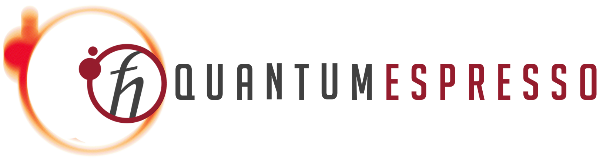
  

## Quantum Transport Module

  

## Continuum (Implicit) Solvation Module 

  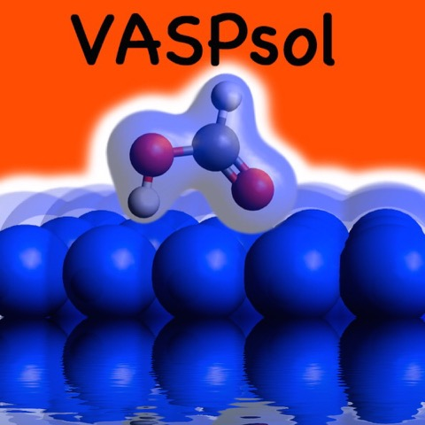

## Scientific Programming & Scripting

  
  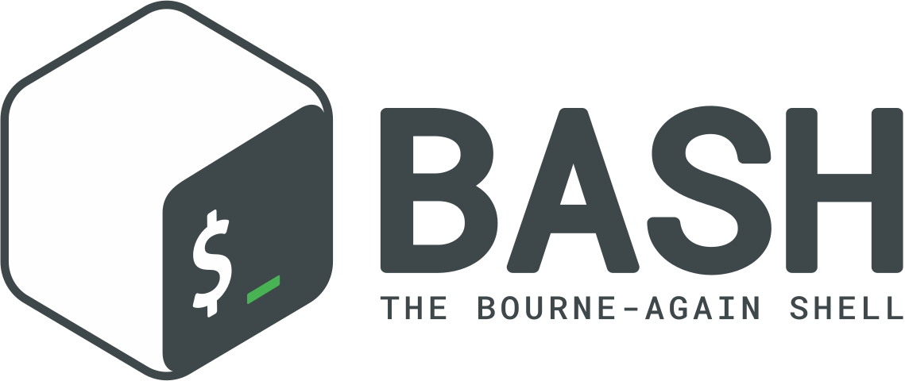

## Visualisation Softwares

  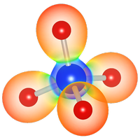
  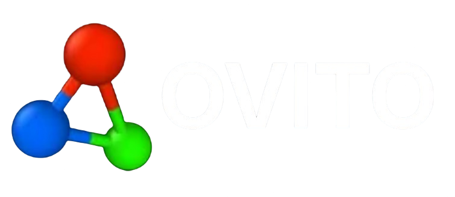
  
  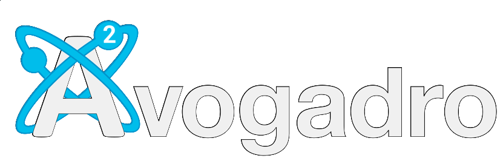
  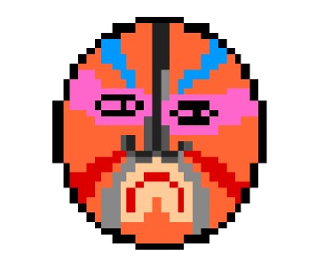

## Scientific Utility Software

  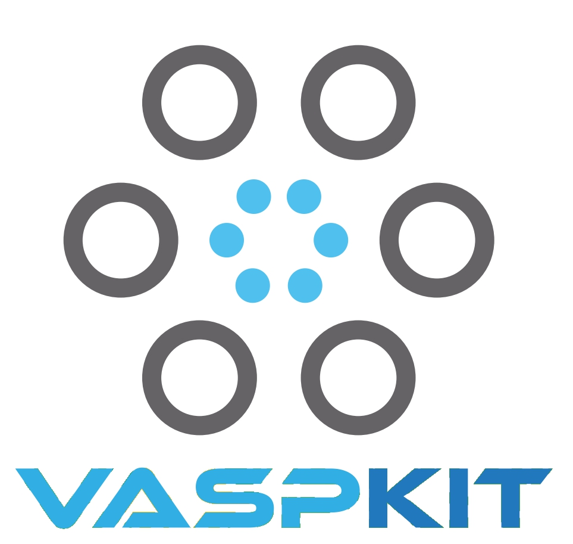

## Operating System

  
  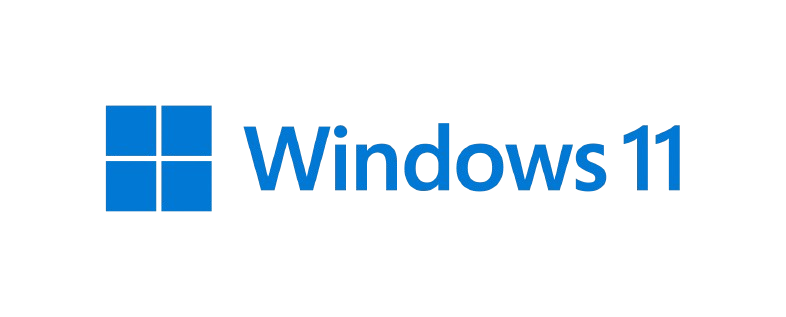

## Graphing Tools

  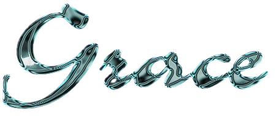
  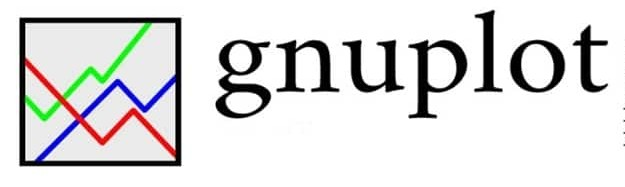

## Presentation & Documentation Tools

  
  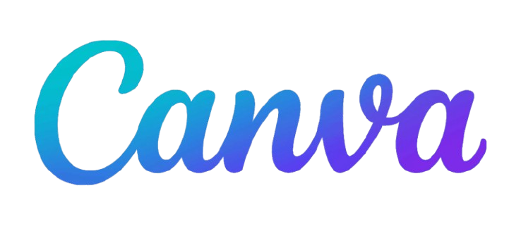
  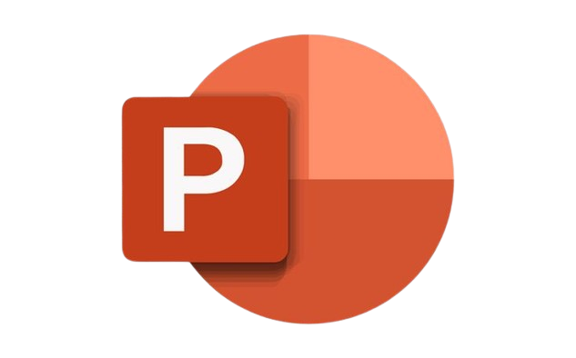

