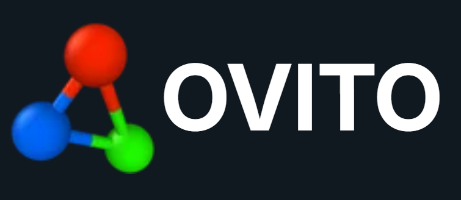

# Abhay Rawat

**Theoretical Condensed Matter Physics | Ab Initio Simulations | DFT | Materials Modeling | Electronic Structure Calculations | Relativistic Spin Orbit Physics | Climbing Image Nudged Elastic Band (CI-NEB)| Computational Catalysis | 2 Dimensional Materials**

---

## About Me

I am a physics graduate with a research focus on first-principles simulations for investigating materials and the exotic properties and phenomena they exhibit. I am currently seeking to pursue a PhD in condensed matter physics, with an emphasis on theoretical modeling and advanced ab initio methods.

## Top Languages

  
  

## Operating System

  
  

## Visualisation

  
  
  
  

